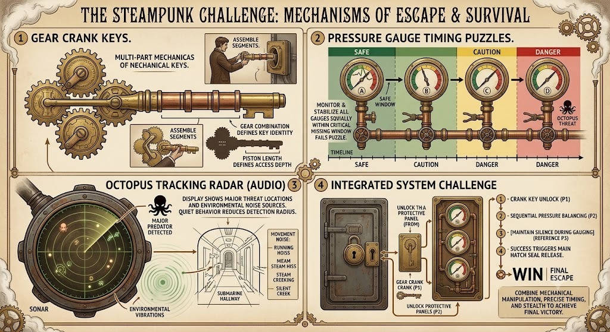

# Aethelgard: Depth of Steam ⚙️🦑
### 2D Steampunk Underwater Survival & Mechanical Escape Odyssey

A high-fidelity 2D Steampunk survival and escape game built with modern HTML5 Canvas, Web Audio API procedural acoustics, dynamic volumetric lighting, and real-time acoustic stealth mechanics.



---

## 🎮 Game Story & Objective

Trapped deep within an underwater research and power facility ("Sector 7: Depths"), you play as an **Atmospheric Heavy Diver**. The station's structural seals have failed, triggering a **5-minute emergency flooding countdown**.

To escape before total collapse:
1. **Scavenge all 4 Key Components** scattered in heavy industrial chests across the station (tracked on your Sonar Radar).
2. **Evade the Dreadnought Steam Octopus Boss**—a lethal tracked automaton that stalks corridors using acoustic hearing (running makes loud vibrations that draw its attention!).
3. **Assemble and Calibrate the Gear Crank Key** at the North Escape Airlock.
4. **Manage your Oxygen (O2) Supply** by using high-pressure air refill stations as corridors flood.
5. **Balance the 4 Sequential Steam Pressure Gauges (A ➔ B ➔ C ➔ D)** at the Boiler Junction.
6. **Disengage the Main Airlock Seals** and escape into the open sea!

---

## 🕹️ Controls

| Key | Action |
| :--- | :--- |
| `W`, `A`, `S`, `D` / `Arrows` | 8-Directional Movement |
| `Mouse Cursor` | Aim / Orientation / Directional Turning |
| `Left Shift` | **Sprint** (High speed, drains Steam & Oxygen, generates loud Sonar ripples!) |
| `Left Ctrl` / `C` | **Sneak** (Silent crawling, completely suppresses footstep noise on Sonar) |
| `E` or `Space` | **Interact** (Open Chests, Refill O2, Solve Puzzles, Turn Valves, Unlock Hatch) |
| `F` | **Toggle Lantern Spotlight** (Volumetric light cone through murky water) |
| `M` / `Tab` | **Archival Blueprints & Schematics** |

---

## 📡 Unified Sonar Radar System

The 210px CRT phosphor acoustic radar in the bottom-right corner tracks all active facility entities simultaneously:

- 🟢 **Human Diver (YOU)**: Center position marker with directional heading arrow.
- 🔴 **Dreadnought Steam Octopus**: Real-time threat beacon showing exact proximity distance in meters (`e.g. 18m`) and alert status rings.
- 🟡 **All 4 Key Components**:
  - `KEY 1`: Small Brass Sprocket (Workshop West)
  - `KEY 2`: Heavy Drive Gear (Catwalk East)
  - `KEY 3`: Telescoping Piston Stem (Storage South-West)
  - `KEY 4`: Master Crank Pinion (Boiler South-East)
- 🔵 **Escape Airlock & Pressure Manifold**: Location markers for the final escape hatch.
- ⚪ **Oxygen Canisters (O2)**: Emergency breathing air recharge stations.

---

## 🚀 How to Run & Play

### Option 1: One-Click Windows Launcher
Double-click `start_game.bat` in the root folder.

### Option 2: Python Local Server
```bash
python server.py
```
Opens immediately in your default browser at `http://localhost:8000/index.html`.

### Option 3: Direct Browser Launch
Open `index.html` directly in any modern browser (Chrome, Edge, Firefox).

---

## 🛠️ Tech Stack & Architecture

- **Vanilla HTML5 Canvas & JavaScript** (Zero external dependencies or frameworks).
- **Pure Web Audio API**: Procedural generation for sonar pings, metallic diver footsteps, pressurized water spray, steam bursts, scuba regulator breathing, and brass victory chimes.
- **Dynamic Volumetric Lighting**: Offscreen canvas pass with light scattering, penumbra falloff, and red automaton ocular searchlights.
- **Realistic Particle Physics**: High-velocity water jet leaks, floor splash puddle ripples, billowing multi-layered steam plumes, and molten sparks.

---

## 📜 License
MIT License. Created by [kmahadevaprasad41-ui](https://github.com/kmahadevaprasad41-ui).
